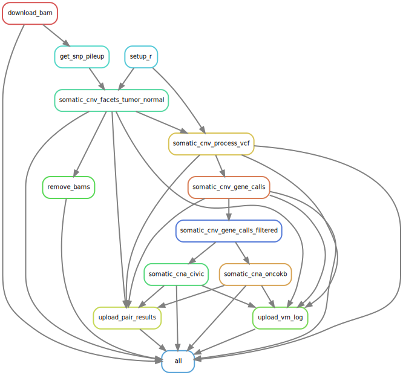

# Organisation

The workflow of the analysis is divided in rules that are assembled in the snakemake subfiles of `workflow/rules` which
are themselves included in the global snakemake file `workflow/Snakefile`. The rules call scripts located in the
`workflow/scripts` folder.

The parameters of the analysis may be modified in the `config/config.yaml` file. All libraries needed for running the
analysis are installed during the first steps of the pipeline through [conda virtual
environments](https://conda.io/projects/conda/en/latest/user-guide/tasks/manage-environments.html) whose specifications
are given in the folder `workflow/envs`.

# How to run the analysis?

## System requirements

In order to run the analysis, ensure the `snakemake` and `conda` commands are available (if you are on a HPC using
slurm, you may use `module load` to load [modules](https://curc.readthedocs.io/en/latest/compute/modules.html) providing
you with these commands). When launching the command, you need to be placed in an environment where `snakemake` command 
(min version 5.4.0) is available and where the python library `pandas` is installed. It is recommended you create your
own environment using the file `workflow/envs/snakemake.yaml` through the command

```
conda env create -f workflow/envs/snakemake.yaml
```

## Data requirements

### config

For this whole-exome sequencing data analysis pipeline, you must provide 3 files in the `config` folder, namely

* `imeta_output.tsv`. The output of IRODS imeta output for the project you are analyzing.

* `samples.tsv`. This file must contain the following columns
  + `Sample_Id` identifier, unique for each row. Clean id.
  + `Sample_Type` either `DNA_N` or `DNA_T`.
  + `File_Name` name of the BAM file.
  + `Index_File_Name` name of the BAM file index.
  + `File_Name_Key` google-cloud path to the BAM file.
  + `Index_File_Name_Key` google-cloud path to the BAM file index.
  + `MSKCC_Oncotree` the type of tumor form which the sample was biopsied. Used for the rule `somatic_oncokb_maf`. See
    the [MSKCC oncotree online](http://oncotree.mskcc.org/#/home).
  + `Civic_Disease` the type of tumor form which the sample was biopsied. Used for the rule `somatic_civic_maf`. see
    the sheet "[last_date_update]-ClinicalEvidenceSummaries.tsv" available for download  after registration 
    [here](https://civicdb.org/home).
  + `Gender` the gender of the patient, either "Male" or "Female" (case-insensitive).

* `tumor_normal_pairs.tsv`. This file must contain the following columns
  + `DNA_T` identifier of the tumor. Only values matched in `Sample_Id` of `samples.tsv` will be used.
  + `DNA_N` identifier of the normal. Only values matched in `Sample_Id` of `samples.tsv` will be used.
  + `DNA_P` identifier of the pair tumor_vs_normal. Only pairs matched from combinations of `Sample_Id` of `samples.tsv` will be used.
  + `MSKCC_Oncotree` the type of tumor form which the sample was biopsied. Used for the rule `somatic_oncokb_maf`. See
    the [MSKCC oncotree online](http://oncotree.mskcc.org/#/home).
  + `Civic_Disease` the type of tumor from which the sample was biopsied. Used for the rule `somatic_civic_maf`. see
    the sheet "[last_date_update]-ClinicalEvidenceSummaries.tsv" available for download  after registration 
    [here](https://civicdb.org/home).
  + `Gender` the gender of the patient, either "Male" or "Female" (case-insensitive).

Examples of such files are provided in the `config` folder. The script that were used to generate these files is available
at

* `workflow/scripts/prepare_samples.py`

###  external

There are some tools that are only available upon request or on public github repositories and therefore are not
installed automatically through the conda environment. Most of the tools are installed automatically during the pipeline
except for the following

+ `CivicAnnotator` available upon request to authors

Add these tools manually to the `external` folder. The folder used for running the example contains the following
subfolders after the pipeline is finished.

+ `CivicAnnotator`
+ `oncokb-annotator`

### resources

For running with the provided `config.yaml` file, you must have a `resources` folder at the root of this repository with
at least the following subfolders.  It is not mandatory to have the same structure, or the same files. Update the file
`config.yaml` according to your needs.

+ `hg38_gatk` fasta files for reference genome as well as reference sets of variants on normal populations. See in
  `config.yaml` file for more details as well as
  [here](https://console.cloud.google.com/storage/browser/gatk-best-practices/somatic-hg38) for some of the files.
  Contents of the folder used for running the example. 
  * af-only-gnomad.hg38.vcf.gz
  * af-only-gnomad.hg38.vcf.gz.tbi

+ `civic` files from the CIViC database and in-house files.
  * 01-Jan-2022-ClinicalEvidenceSummaries_Annotated.xlsx. Manual modification of
    01-Jan-2022-ClinicalEvidenceSummaries.xlsx. Available upon request to author.
  * 01-Jan-2022-GeneSummaries.tsv.
  * CIViC_Curation_And_Rules_Mutation.xlsx. Available upon request to authors.

+ `facets_suite` files related to facetsSuite R package see [here](https://github.com/mskcc/facets-suite).
  * facets_suite_arm_level_rules.xlsx. Available upon request to authors.

+ `gene_set` bed file of gene coordinates
  * Homo_sapiens.GRCh38.104.gff3.gene.bed. This file was built from Homo_sapiens.GRCh38.104.gff3.gz available in
  FTP repository of ensembl (<http://ftp.ensembl.org/pub/release-104/gff3/homo_sapiens/>).

+ `oncokb` files from the OncoKB database and in-house files.
  * cancerGeneList_10_01_2022.tsv
  * OncoKB_Curation_And_Rules.xlsx. Available upon request to authors.


## The snakemake command

You can launch the full pipeline via

```
snakemake -s workflow/Snakefile --jobs [n_jobs] --profile [your_profile]
```

where `[n_jobs]` is the maximum number of CPUs (or jobs if you are on a cluster) to be used/run in parallel and
`[your_profile]` your snakemake profile (read the [snakemake
documentation](<https://snakemake.readthedocs.io/en/stable/executing/cli.html#profiles>)).

In case you are only interested in running part of the analysis so as to reproduce one of the results file, you may do
so with

```
snakemake -s workflow/Snakefile --jobs [n_jobs] --profile [your_profile] [path/to/file/you/want/to/reproduce]
```

# Workflow graph

Here is the graph of the workflow




# Dry-run example on 2 pairs tumor/normal

The command ran is

```
snakemake -s workflow/Snakefile --profile slurm -n
```

and the summary of the jobs that will be run

``` 
Job stats:
job                                count    min threads    max threads
-------------------------------  -------  -------------  -------------
all                                    1              1              1
somatic_cna_civic                      2              1              1
somatic_cna_civic_filter               2              1              1
somatic_cna_civic_preprocess           2              1              1
somatic_cna_oncokb                     2              1              1
somatic_cna_oncokb_filter              2              1              1
somatic_cna_oncokb_preprocess          2              1              1
somatic_cnv_bed                        2              1              1
somatic_cnv_calls                      2              1              1
somatic_cnv_chr_arm_sum                2              1              1
somatic_cnv_facets_tumor_normal        2             10             10
somatic_cnv_table                      2              1              1
total                                 23              1             10

This was a dry-run (flag -n). The order of jobs does not reflect the order of execution.
```
